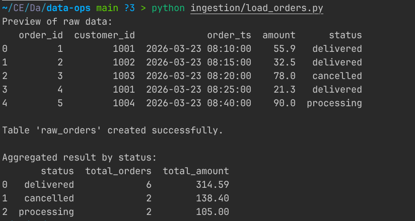
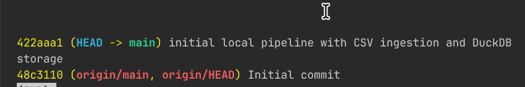
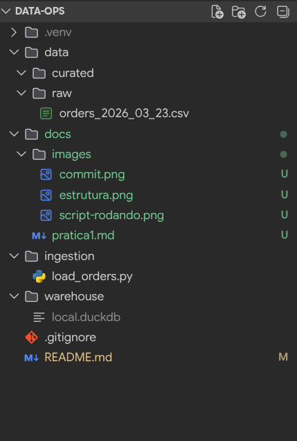

<div align="center">
  <h1>DataOps Mini Lab</h1>
  <p>Pipeline local de ingestão de pedidos com Python, Pandas e DuckDB</p>
</div>

---

## Contexto

Este laboratório propõe a construção de um pipeline de dados simples para ingestão diária de pedidos em CSV, armazenamento em DuckDB e consulta analítica inicial. O objetivo é criar uma base funcional para evoluir com práticas de DataOps como rastreabilidade, rollback, contratos de dados e governança.

---

## Estrutura do Projeto

```
data-ops/
├── data/
│   ├── raw/
│   │   └── orders_2026_03_23.csv
│   └── curated/
├── ingestion/
│   └── load_orders.py
├── warehouse/
│   └── local.duckdb
├── docs/
├── .gitignore
├── README.md
```

---

## Tecnologias Utilizadas

- Python 3.11+
- pandas
- DuckDB
- Git
- VS Code ou editor equivalente

---

## Como Executar

1. **Crie e ative o ambiente virtual:**
	```bash
	python -m venv .venv
	source .venv/bin/activate  # Linux/Mac
	# .venv\Scripts\activate  # Windows
	python -m pip install --upgrade pip
	```
2. **Instale as dependências:**
	```bash
	pip install pandas duckdb
	```
3. **Execute o pipeline:**
	```bash
	python ingestion/load_orders.py
	```

---

## Evidências de Execução

### 1. Execução do Script


### 2. Commit no Git


### 3. Estrutura do Projeto


---

## Reflexões Finais

As respostas da reflexão final estão disponíveis em:

- Reflexão Final da Prática 1: [docs/pratica1.md](docs/pratica1.md).
